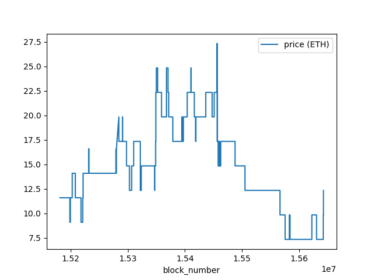
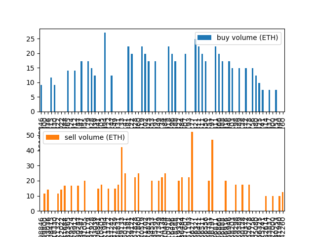
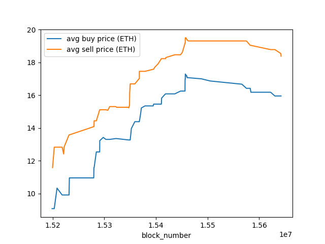
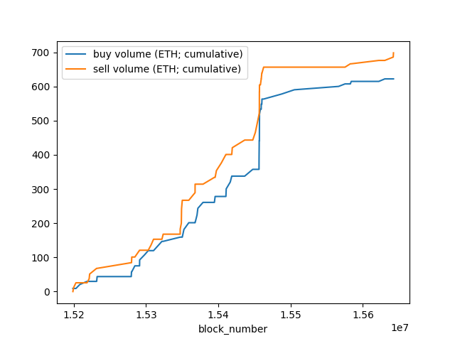
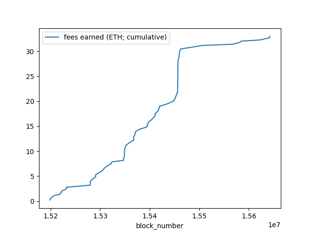
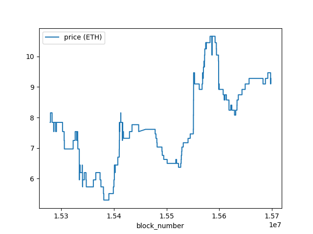
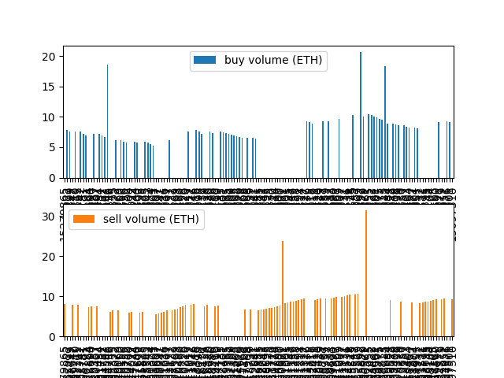
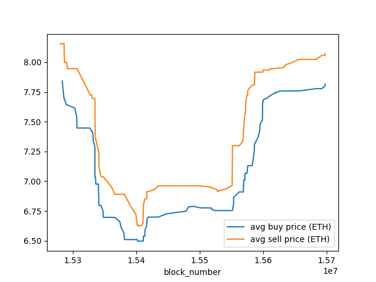
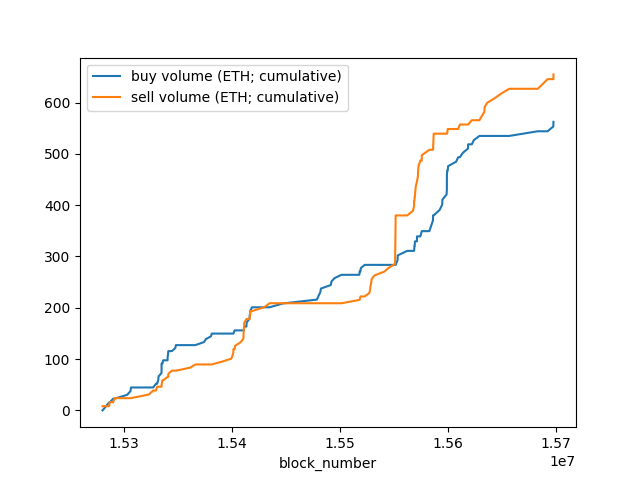
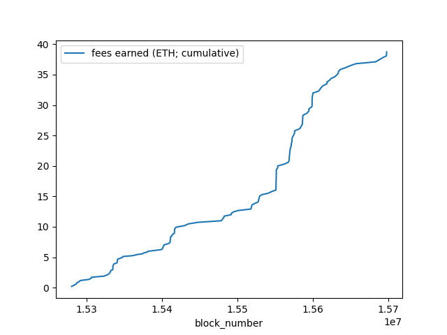

# sudo-ape

Charts for sudooooo swap using ApeWorX

- 0xmons (pool: [0x5caf332dca4e6c9e69d52f320c21e74845353db0](https://etherscan.io/address/0x5caf332dca4e6c9e69d52f320c21e74845353db0))








- azuki (pool: [0x16F71D593bc6446a16eF84551cF8D76ff5973db1](https://etherscan.io/address/0x16F71D593bc6446a16eF84551cF8D76ff5973db1))







## Setup

Most of the [sudoswap](https://github.com/sudoswap/lssvm) pair contracts `LSSVMPair.sol` are **not** verified on Etherscan, so I went for a manual workaround by compiling locally in this project. This allows using ApeWorX's out-of-the-box `Contract` functionality to query for the events we care about.

Relevant needed contracts are in the `contracts/` folder. Simply

```
ape compile
```

and the notebook should run fine. Then,

```
ape notebook
```


## Environment

Example `.env.example` file included, which assumes using Alchemy as the network provider:

```
$ export WEB3_ALCHEMY_PROJECT_ID=MY_ALCHEMY_PROJECT_ID
$ export ETHERSCAN_TOKEN=MY_ETHERSCAN_TOKEN
```

Substitute `WEB3_ALCHEMY_PROJECT_ID` for another environment variable if using a different provider (e.g. [Infura](https://github.com/ApeWorX/ape-infura#quick-usage)).


## TODOs

For a given collection address, plot over all existing pools:

- [ ] prices and volume
- [ ] liquidity
- [ ] % slippage (curve) and fee metrics (or normalize by these)
- [ ] arbitrage opportunities (price differences between pools)
